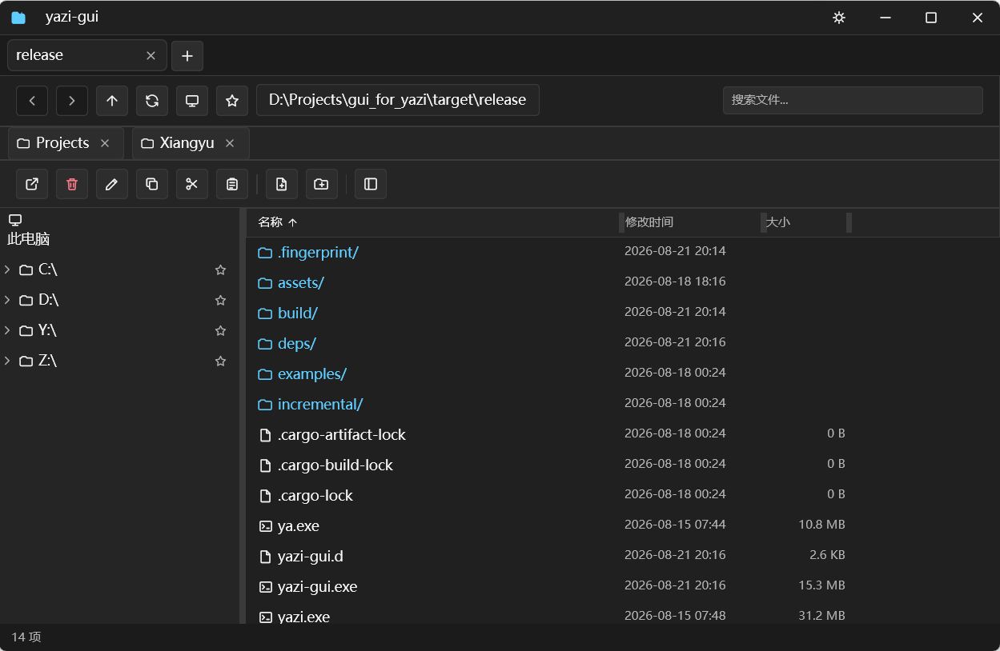
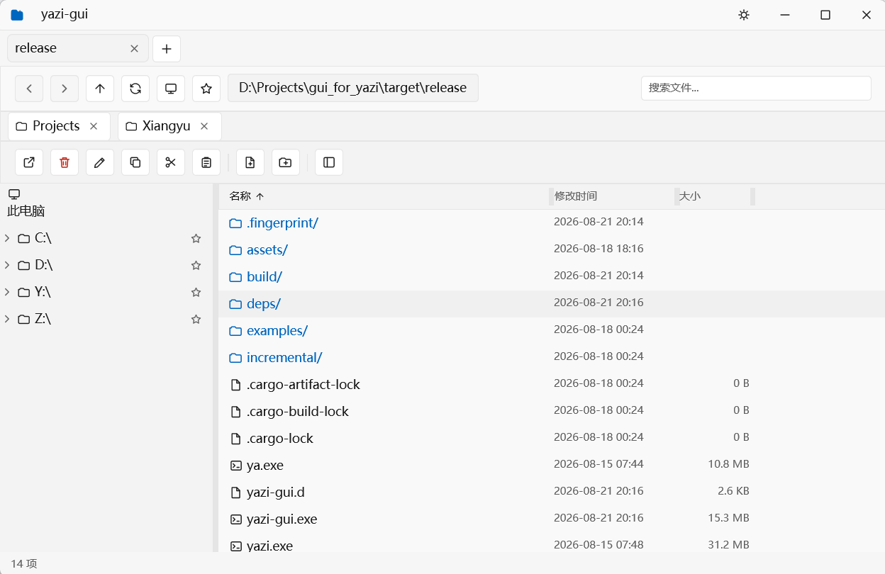
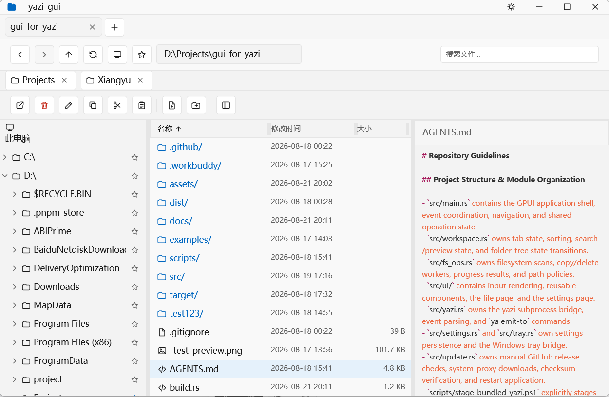

# yazi-gui

[English](#english) · [中文](#中文) · [Screenshots](#screenshots)

`yazi-gui` is a Windows-first graphical file manager for [yazi](https://github.com/sxyazi/yazi), built with [GPUI](https://github.com/zed-industries/zed/tree/main/crates/gpui). It brings yazi's fast directory backend and event stream into a native desktop interface with tabs, previews, search, file operations, and resizable panes.

## English

The GUI owns interaction, layout, previews, and Windows integration. yazi remains the source of directory state and navigation events through a lightweight DDS bridge, so the project keeps yazi's behavior while making it easier to use with a mouse, keyboard, or touchpad.

### Features

- Multi-tab navigation with directory-first listings and sorting by name, modified time, or size.
- Address navigation, recursive search, inline rename/create editing, and localized command tooltips.
- File previews with syntax highlighting, image previews, and local-time modified timestamps.
- Resizable folder tree, file columns, and preview panel with aligned name, modified, and size data.
- A consistent local SVG icon system for the titlebar, navigation, file actions, folder tree, favorites, and file types; dark and light themes share the same geometry.
- Copy, cut, and paste with byte-level progress and cancellation at copy block boundaries.
- Computer View for Windows drives, refresh, Recycle Bin deletion for local paths, and confirmation-based permanent deletion on network paths.
- Settings for theme, language, shortcuts, autostart, tray behavior, about information, and manual updates.
- Windows-native custom titlebar, tray integration, release checks, system-proxy downloads, checksum verification, and restart-to-update flow.

### Requirements

- Windows with a Rust Edition 2024 toolchain.
- The GUI-only build requires `yazi` and `ya` installed and available on `PATH`.
- The bundled release uses yazi/ya `26.8.15` for Windows x64.

### Getting started

Run the GUI from the current working directory during development:

```powershell
cargo run
```

Build the GUI-only release executable:

```powershell
cargo build --release
.\target\release\yazi-gui.exe
```

To prepare a bundled local build, explicitly stage the fixed yazi package beside the executable:

```powershell
cargo build --release --features bundled-yazi
.\scripts\stage-bundled-yazi.ps1 -YaziDirectory 'path\to\yazi-26.8.15'
```

The staging command validates that both `yazi.exe` and `ya.exe` are version `26.8.15`; the bundled executable does not use `PATH` at runtime.

Useful checks:

```powershell
cargo fmt --all
cargo check
cargo test
```

### Release packages

Each `v*` tag creates two Windows x64 archives:

- GUI-only: uses yazi/ya from `PATH`.
- Bundled: includes yazi/ya `26.8.15` and the repository's runtime yazi configuration.

Both archives include `SHA256SUMS.txt`. The Settings page can check the latest stable GitHub Release for the matching package, download it through the Windows system proxy with byte progress and cancellation, verify its SHA-256 checksum, and offer a restart to apply the update.

Settings are stored in `%APPDATA%\yazi-gui\settings.json`. Runtime yazi configuration lives under `assets/yazi/`, where the `gui-files.yazi` plugin publishes directory snapshots consumed by the GUI.

### Project layout

- `src/main.rs` — GPUI application shell, tabs, navigation, previews, search, and operation coordination.
- `src/workspace.rs` — tab state, sorting, selection, search state, and folder-tree transitions.
- `src/fs_ops.rs` — filesystem scans, copy/delete workers, progress reporting, and path policies.
- `src/ui/` — reusable components, file/settings pages, input handling, and the typed SVG icon renderer.
- `src/yazi.rs` — yazi subprocess bridge, event parsing, and `ya emit-to` commands.
- `src/settings.rs` / `src/platform/tray.rs` — settings persistence and the Windows tray bridge.
- `src/update.rs` — GitHub release checks, system-proxy downloads, checksum verification, and restart updates.
- `assets/yazi/` — bundled yazi configuration and the `gui-files.yazi` event plugin.
- `assets/icons/` — brand SVG/ICO resources and the local functional SVG icon set.
- `docs/screenshots/` — README product screenshots.
- `docs/adr/` — architecture decision records, including the icon-system decision.

## Screenshots

<p align='center'>
  
  
</p>

<p align='center'>
  <em>Dark theme · 深色主题</em>&nbsp;&nbsp;&nbsp;&nbsp;&nbsp;&nbsp;&nbsp;&nbsp;<em>Light theme · 浅色主题</em>
</p>

<p align='center'>
  
</p>

<p align='center'><em>Light theme with project tree and file preview · 浅色主题、项目目录树与文件预览</em></p>

## 中文

`yazi-gui` 是一个面向 Windows 的原生图形文件管理器，基于 [GPUI](https://github.com/zed-industries/zed/tree/main/crates/gpui) 构建，由 [yazi](https://github.com/sxyazi/yazi) 提供目录状态与导航事件。它保留 yazi 的后端能力，同时提供更适合桌面使用的标签页、预览、搜索、文件操作和可调布局。

GUI 负责交互、布局、预览和 Windows 集成；yazi 通过轻量 DDS 桥接持续提供目录快照和导航事件。这样既能使用鼠标和触控板，也不会重复实现 yazi 的目录状态逻辑。

### 功能

- 多标签页、目录优先列表，以及按名称、修改时间或大小排序。
- 地址栏跳转、递归文件搜索、文件名行内重命名与新建，并支持本地化命令提示。
- 文件预览、语法高亮、图片预览，以及本地时间格式的修改时间。
- 文件夹树、文件列和预览面板可拖拽调整宽度，名称/修改时间/大小保持对齐。
- 标题栏、导航、文件操作、目录树、收藏和文件类型统一使用本地 SVG 图标系统，深色与浅色主题共用同一套几何风格。
- 复制/剪切/粘贴；复制显示字节级进度，可在块边界取消。
- “此电脑”磁盘视图、刷新、本地路径回收站删除，以及网络路径永久删除确认。
- 主题、语言、快捷键、自启动、托盘、关于和手动更新设置。
- Windows 原生自定义标题栏、托盘集成、Release 检查、系统代理下载、校验和验证以及重启更新。

### 环境要求

- Windows，Rust Edition 2024 工具链。
- GUI-only 构建需要已安装并加入 `PATH` 的 `yazi` 和 `ya`。
- bundled release 使用 Windows x64 版本的 yazi/ya `26.8.15`。

### 快速开始

开发时从当前工作目录启动：

```powershell
cargo run
```

构建 GUI-only release：

```powershell
cargo build --release
.\target\release\yazi-gui.exe
```

本地构建 bundled 版本时，需要显式将固定版本的 yazi 放到可执行文件旁：

```powershell
cargo build --release --features bundled-yazi
.\scripts\stage-bundled-yazi.ps1 -YaziDirectory 'path\to\yazi-26.8.15'
```

staging 命令会验证 `yazi.exe` 和 `ya.exe` 都是 `26.8.15`；bundled 可执行文件运行时不会使用 `PATH`。

常用验证命令：

```powershell
cargo fmt --all
cargo check
cargo test
```

### Release 包

每个 `v*` tag 会创建两个 Windows x64 压缩包：GUI-only 包使用 `PATH` 中的 yazi/ya，bundled 包内置 yazi/ya `26.8.15` 和仓库中的运行时 yazi 配置。两个包都附带 `SHA256SUMS.txt`。

设置页可以检查与当前包匹配的最新稳定版 GitHub Release，使用 Windows 系统代理下载并显示字节进度、支持取消，校验 SHA-256 后提供重启更新。

设置保存在 `%APPDATA%\yazi-gui\settings.json`；运行时 yazi 配置位于 `assets/yazi/`，其中的 `gui-files.yazi` 插件负责向 GUI 发布目录快照。

### 项目结构

- `src/main.rs` — GPUI 应用壳、标签页、导航、预览、搜索和操作协调。
- `src/workspace.rs` — 标签页状态、排序、选择、搜索状态和目录树状态转换。
- `src/fs_ops.rs` — 文件系统扫描、复制/删除 worker、进度报告和路径策略。
- `src/ui/` — 可复用组件、文件页、设置页、输入处理和类型化 SVG 图标渲染器。
- `src/yazi.rs` — yazi 子进程桥接、事件解析和 `ya emit-to` 命令。
- `src/settings.rs` / `src/platform/tray.rs` — 设置持久化和 Windows 托盘桥接。
- `src/update.rs` — GitHub Release 检查、系统代理下载、校验和验证与重启更新。
- `assets/yazi/` — 内置 yazi 配置与 `gui-files.yazi` 事件插件。
- `assets/icons/` — 品牌 SVG/ICO 资源和本地功能 SVG 图标集。
- `docs/screenshots/` — README 产品截图。
- `docs/adr/` — 架构决策记录，包括图标系统决策。
